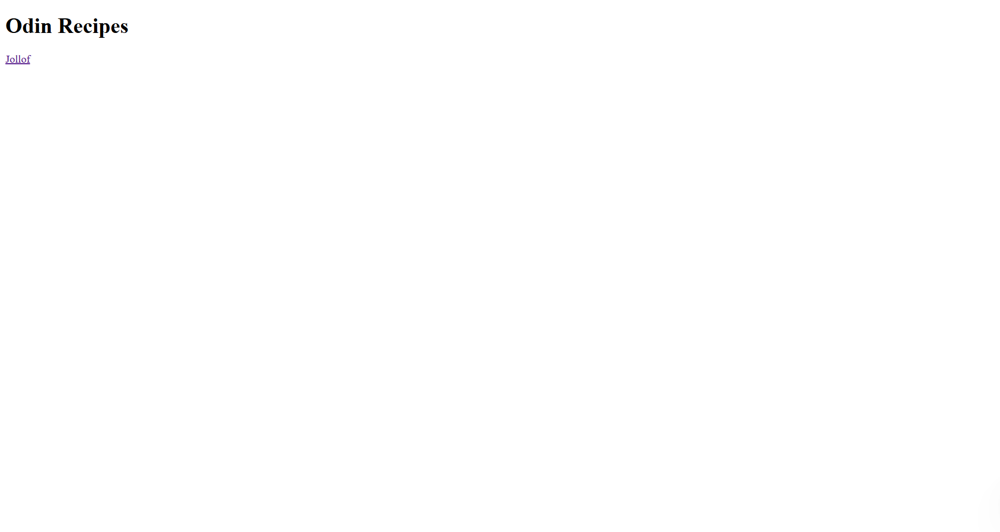

# odin_recipes

This is a simple HTML project built as part of The Odin Project curriculum. It showcases basic webpage structure, linking, and the use of images and lists.

##  Live Preview
View the live site here (https://github.com/MatthewTuurozeeng/odin_recipes)  

##  What the Project Includes

- **Home Page (`index.html`)**
  - Introduces the project.
  - Contains a link to the Jollof recipe page.

- **Jollof Recipe Page (`jollof.html`)**
  - Displays an image of a delicious jollof rice meal.
  - Includes a list of links to images of the ingredients used.
  - Provides step-by-step instructions on how to cook jollof rice.

## Skills Demonstrated

- HTML page structure
- Linking between pages
- Embedding images
- Creating ordered and unordered lists

##  Screenshots
### Home page

### jollof page

## Status

This is a beginner-friendly recipe site and will be improved further as I learn more web development skills.
