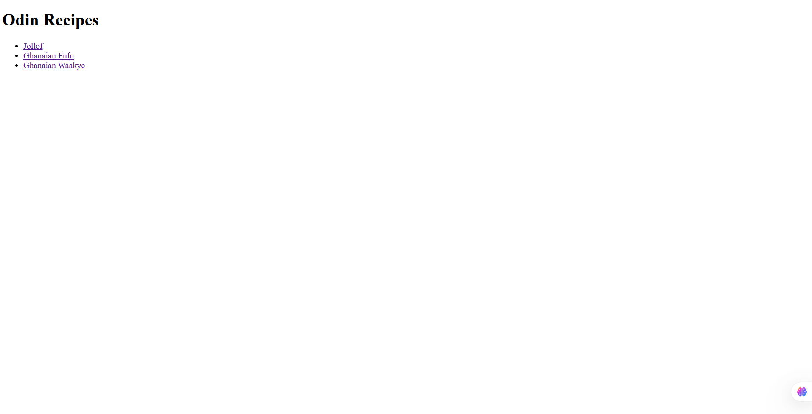
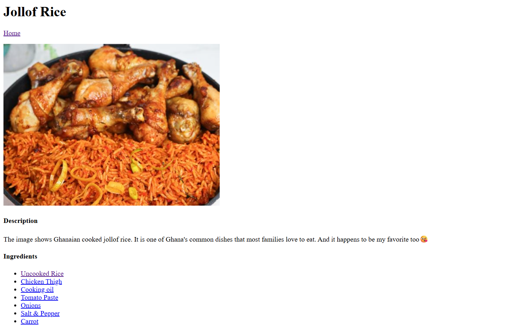
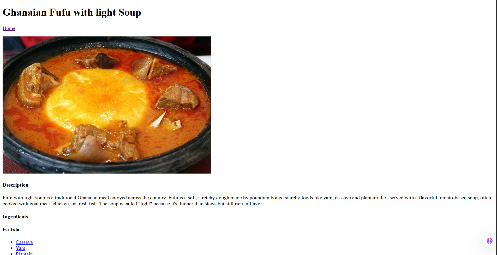
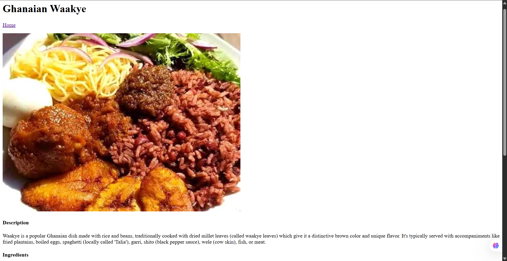

# odin_recipes

This is a beginner-level web development project built as part of [The Odin Project](https://www.theodinproject.com/) curriculum. It showcases basic webpage structure, linking, and the use of images and lists.

The project features a simple website that contains popular Ghanaian recipes: **Jollof Rice**, **Waakye**, and **Fufu**. The goal of the project was to practice basic HTML structure, linking between pages, displaying images, and organizing content clearly.

##  Live Preview
Click here to view the live site (https://github.com/MatthewTuurozeeng/odin_recipes)  

##  What the Project Includes

- **Home Page (`index.html`)**
  - Introduces the project.
  - Contains a link to the individual recipe pages.
  - Navigation links to go back to the homepage.
  - Each recipe page follows the same structure and contains:
   -> A title and image of the meal
   -> A list of **ingredients**
   -> Links to images of each ingredient
   -> Step-by-step **instructions** for preparing the meal.

## Skills Demonstrated
- HTML page structure
- Linking between pages
- Embedding images
- Creating ordered and unordered lists

##  Screenshots
### Home page

### jollof page

### fufu page

### waakye page

## Status

This is a beginner-friendly recipe site and will be improved further as I learn more web development skills.
